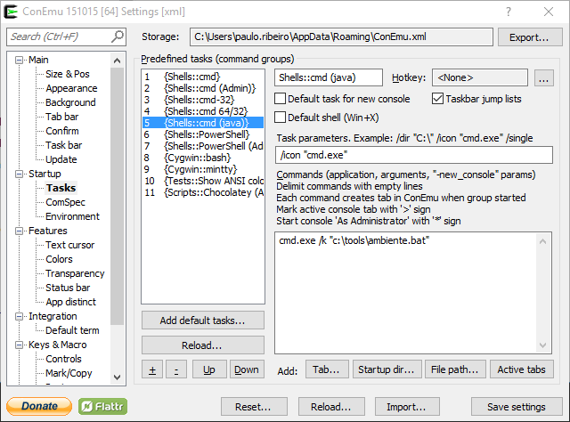
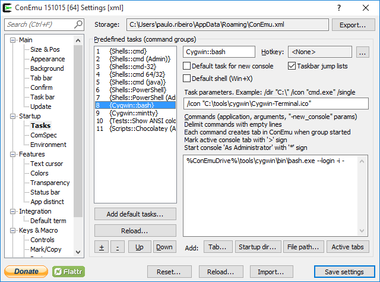
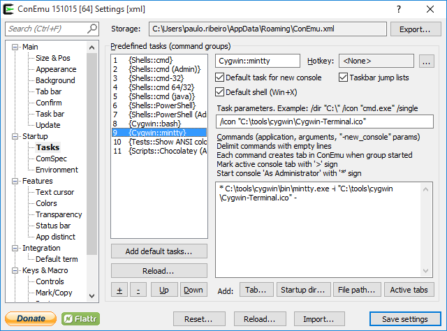

# ConEmu

## Sobre

Leia sobre o ConEmu em https://conemu.github.io/.

## Tasks

### Shells::cmd(java)

Essa task abre o `cmd.exe` (em modo não administrativo) já com as variáveis de ambiente ajustadas no arquivo [../ambiente.bat](../ambiente.bat):

### Cygwin::bash

Essa task abre o 'bash' do Cygwin em modo não administrativo. 

* Lado bom: roda, razoavelmente bem, o [JBoss Forge]. ([leia sobre o problema][forge-cygwin])
* Incoveniente: não possibilita a execução do [tmux].

### Cygwin::mintty

Essa task abre o 'mintty' do Cygwin em modo administrativo. 

* Lado bom: roda o [tmux].
* Incoveniente: não possibilita a correta execução do [JBoss Forge]. ([leia sobre o problema][forge-cygwin])

[tmux]: https://tmux.github.io/
[JBoss Forge]: http://forge.jboss.org/
[forge-cygwin]: https://developer.jboss.org/thread/237200?_sscc=t
